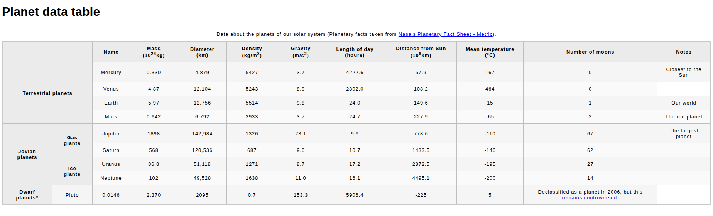

Planet Data Table 🌌

I made this HTML table to display data about the planets in our solar system—terrestrial planets, Jovian planets, and even dwarf planets!

I used examples from the Mozilla Developer Network (MDN)
 to learn how to create tables that are semantic, accessible, and readable. Along the way, I got hands-on with <thead>, <tbody>, <th>, scope, and row/column spans.

This project was super fun because I could organize all the planet facts neatly while learning how to make my tables look good and work well for accessibility.

Open index.html in your browser and check out the planets! 🚀

### OH and here is how the table looks!
